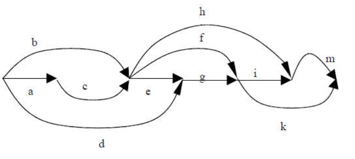
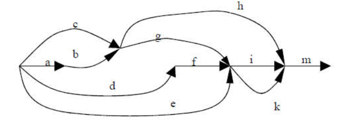
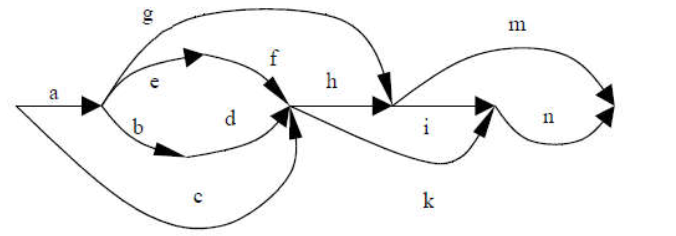
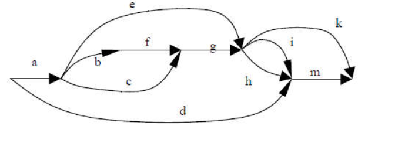
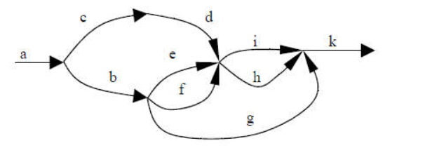
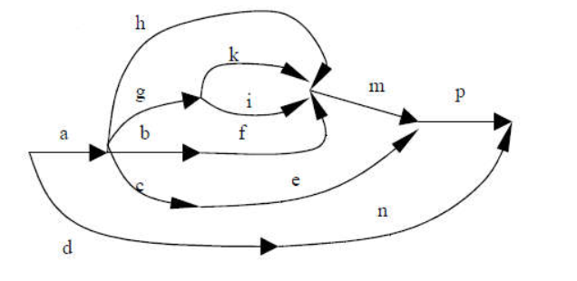
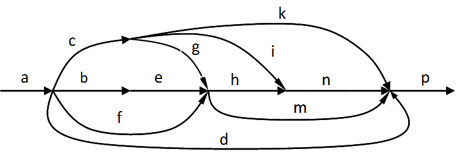

# Лабораторная Работа №2. Разработка многопоточного приложения средствами POSIX в ОС Linux или Mac OS
## Цель работы
Знакомство с многопоточным программированием и методами синхронизации потоков средствами POSIX.

## Задание
1.	Вычислить номер варианта задания как остаток от деления **суммы порядкового номера** студента по списку в журнале и **числа 5** на количество вариантов заданий. Если остаток равен нулю, необходимо брать последнее задание.  
**Nвар = (Nв_списке + 5) mod K**,  
где Nвар - искомый номер варианта, Nв_списке - порядковый номер студента по списку в журнале, K - количество вариантов заданий на данную лабораторную работу.
2.	Выбрать граф запуска потоков соответственно варианту задания. Вершины графа являются точками запуска/завершения потоков, дугами обозначены сами потоки, длину дуги следует интерпретировать как ориентировочное время выполнения потока.
3.	Самостоятельно выделить на графе три группы потоков. Первая группа не синхронизирована, вторая – синхронизирована мьютексом (захватывает мьютекс на время выполнения), третья – синхронизирована семафорами (передает управление другому потоку после каждой итерации).
4.	Реализовать последовательно-параллельный запуск потоков в ОС Linux или Mac OS X с использованием средств POSIX для запуска и синхронизации потоков. Запрещается использовать какие-либо библиотеки и модули, решающие задачу кроссплатформенной разработки многопоточных приложений (std::thread, Qt Thread, Boost Thread и т.п.).  

В процессе своей работы каждый поток выводит свою букву в консоль. Оценка правильности выполнения лабораторной работы осуществляется следующим образом. Если потоки **a** и **b** согласно графу должны выполняться параллельно, то в консоли должна присутствовать последовательность вида **abababab** (или схожая, например, **aabbba**); если задачи выполняются последовательно, то в консоли присутствует последовательность вида **aaaaabbbbbb**, причем после появления первой буквы **b**, буква **a** больше не должна появиться в консоли. Количество букв, выводимых каждым потоком в консоль, должно быть пропорционально длине дуги, соответствующей данному потоку на графе.

## Содержание отчета
- Титульный лист 
- Цель работы
- Задание на лабораторную работу
- Граф запуска потоков
- Результат выполнения работы
- Исходный код программы с комментариями
- Выводы

## Варианты графов запуска потоков

| Номер варианта  | Граф запуска потоков |
| --- | --- |
| 1   |   |
| 2   |   |
| 3   |   |
| 4   |   |
| 5   |   |
| 6   |   |
| 7   |   |
| 8   |   |
| 9   |   |
| 10  |   |
| 11  |   |
| 12  |   |
| 13  |   |
| 14  |   |
| 15  |   |
| 16  |   |
| 17  |   |
| 18  |   |
| 19  |   |
| 20  |   |

## Вопросы
Электронный адрес для связи: m.polyak [собачка] guap [точка] ru
