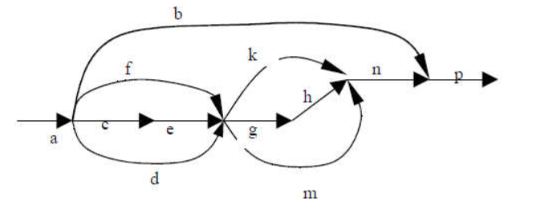
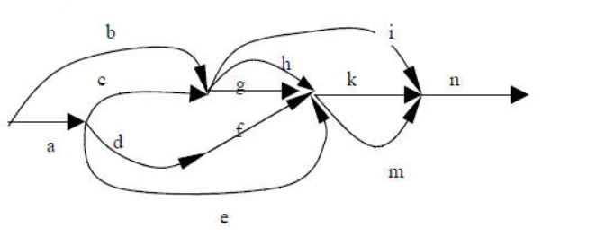
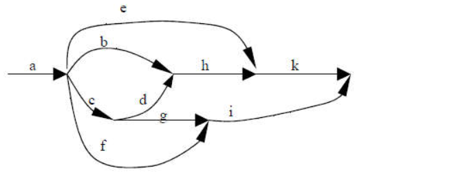
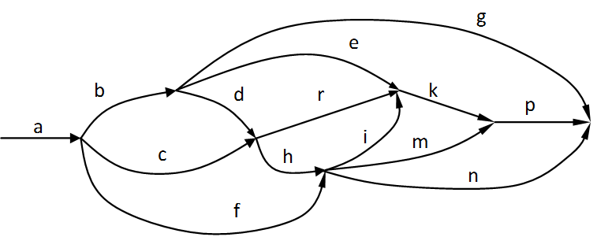

# Лабораторная Работа №2. Разработка многопоточного приложения средствами POSIX в ОС Linux или Mac OS
## Цель работы
Знакомство с многопоточным программированием и методами синхронизации потоков средствами POSIX.

## Задание
1. Вычислить номер варианта задания как остаток от деления **суммы** порядкового номера студента по списку в журнале и **числа 5** на количество вариантов заданий. Если остаток равен нулю, выбрать последнее задание.  
**Nвар = (Nв_списке + 5) mod K**,  
где Nвар - искомый номер варианта, Nв_списке - порядковый номер студента по списку в журнале, K - количество вариантов заданий на данную лабораторную работу.
2. Выбрать граф запуска потоков в соответствии с вариантом задания. Вершины графа являются точками запуска/завершения потоков, дугами обозначены сами потоки, длину дуги следует интерпретировать как ориентировочное время выполнения потока. В процессе своей работы каждый поток должен в цикле выполнять два действия: выводить букву имени потока в консоль, после чего вызывать функцию `computation()` для выполнения сложных расчетов, требующих задействования ЦП на длительное время. Эта функция уже написана и подключается из заголовочного файла `lab2.h`, изменять ее не следует.
3. Самостоятельно выделить на графе две группы с выполняющимися параллельно потоками. Первая группа не синхронизирована, параллельное выполнение входящих в группу потоков происходит за счет планировщика задач (см. [примеры](examples/README.md) [1](examples/README.md#Организация-параллельного-выполнения-потоков-без-использования-средств-синхронизации) и [2](examples/README.md#Использование-мьютекса-для-работы-с-общим-ресурсом)). Вторая группа синхронизирована семафорами и потоки внутри группы выполняются в строго зафиксированном порядке: входящий в групу поток передает управление другому потоку после каждой итерации цикла (см. [пример 3](examples/README.md#Использование-семафоров-для-синхронизации-потоков)). Каждая из двух групп должна включать в себя не менее 1 интервала на графе, состоящего минимум из 3 потоков.
4. Реализовать программу для последовательно-параллельного выполнения потоков в ОС Linux или Mac OS X с использованием средств POSIX для запуска и синхронизации потоков. Запрещается использовать какие-либо библиотеки и модули, решающие задачу кроссплатформенной разработки многопоточных приложений (std::thread, Qt Thread, Boost Thread и т.п.). Для этого необходимо написать код в файле `lab2.cpp`:
    1. Функция `unsigned int lab2_thread_graph_id()` должна возвращать номер графа запуска потоков, полученный на шаге 2.
    2. Функция `const char* lab2_unsynchronized_threads()` должна возвращать разделенный запятой список интервалов, где потоки не синхронизированы (см. предыдущий пункт, а также примеры в файлах [lab2.cpp](lab2.cpp) и [lab2_ex.cpp](lab2_ex.cpp)).
    3. Функция `const char* lab2_sequential_threads()` должна возвращать разделенный запятой список интервалов, где потоки синхронизированы с помощью семафора (-ов) и выполняются в строгой последовательности (см. предыдущий пункт, а также примеры в файлах [lab2.cpp](lab2.cpp) и [lab2_ex.cpp](lab2_ex.cpp)).
    4. Функция `int lab2_init()` заменяет собой функцию `main()`. В ней необходимо реализовать запуск потоков, инициализацию вспомогательных переменных (мьютексов, семафоров и т.п.). Перед выходом из функции `lab2_init()` необходимо убедиться, что все запущенные потоки завершились. Возвращаемое значение: `0` - работа функции завершилась успешно, любое другое числовое значение - при выполнении функции произошла критическая ошибка.
    5. Добавить любые другие необходимые для работы программы функции, переменные и подключаемые файлы.
    6. Создавать функцию `main()` не нужно. В проекте уже имеется готовая функция `main()`, изменять ее нельзя. Она выполняет единственное действие: вызывает функцию `lab2_init()`.
    7. Не следует изменять какие-либо файлы, кроме `lab2.cpp`. Также не следует создавать новые файлы и писать в них код, поскольку код из этих файлов не будет использоваться во время тестирования.
5. Последовательное выполнение потоков может обеспечиваться как за счет использования семафоров, так и с помощью функции `pthread_join()`. Запускать потоки можно как все сразу в функции `lab2_init()`, так и по одному (или группами) из других потоков.


В процессе своей работы каждый поток выводит свою букву в консоль. Оценка правильности выполнения лабораторной работы осуществляется следующим образом. Если потоки **a** и **b** согласно графу должны выполняться параллельно, то в консоли должна присутствовать последовательность вида **abababab** (или схожая, например, **aabbba**); если потоки выполняются последовательно, то в консоли присутствует последовательность вида **aaaaabbbbbb**, причем после появления первой буквы **b**, буква **a** больше не должна появиться в консоли. Количество букв, выводимых каждым потоком в консоль, должно быть пропорционально длине дуги, соответствующей данному потоку на графе. При этом количество символов, выводимых в консоль каждым из потоков, должно быть не меньше чем 3Q и не больше чем 5Q, где Q - количество интервалов на графе, в течении которых выполняется поток. Множитель перед величиной Q следует выбрать одинаковым для всех потоков, задав его равным 3, 4 или 5.

## Пример работы с графом потока
Рассмотрим граф запуска потоков, приведенный на рисунке ниже.


Программа, реализующая указанную на графе последовательность запуска потоков, должна запустить 5 потоков: *a*, *b*, *c*, *d* и *e*. Работу программы можно разбить на три временных интервала:
1. С момента времени T<sub>0</sub> до T<sub>1</sub> работает только поток *a*.
2. С T<sub>1</sub> до T<sub>2</sub> параллельно работают потоки *b*, *c* и *d*.
3. С T<sub>2</sub> до T<sub>3</sub> параллельно работают потоки *d* и *e*.

В файле [lab2_ex.cpp](lab2_ex.cpp) приведен пример выполнения лабораторной работы для рассмотренного графа. Данный пример не проходит тесты, поскольку варианта с таким графом не существует. Скомпилировать и запустить данный пример можно с помощью последовательности команд
```
g++ lab2_ex.cpp main.cpp -lpthread -o lab2_ex
./lab2_ex
```

## Сборка и тестирование
Скомпилировать программу из консоли без использования линковщика можно следующим образом. Сначала необходимо перейти в директорию, в которой находятся исходные файлы lab2.h, lab2.cpp и main.cpp. Далее все команды будут приводиться относительно этой директории.

Компиляция программы в файл `a.out` в текущей папке: 
```
g++ lab2.cpp main.cpp -lpthread
```
При использовании старой версии компилятора GCC может потребоваться дополнительно указать ключ `-std=c++11`. В этом случае компилятор выведет соответствующее сообщение в консоль.

Запуск скомпилированной программы: `./a.out`. При желании можно указать ключ `-o` при компиляции, в этом случае можно будет задать более осмысленное имя итогового файла с программой, нежели `a.out`. Например,
```
g++ lab2.cpp main.cpp -lpthread -o lab2
./lab2
```

### Тестирование
Для запуска тестов на локальной машине предварительно потребуется собрать библиотеку [`gtest`](https://github.com/google/googletest). Для этого, перед первой компиляцией тестов, необходимо выполнить следующую последовательность команд:
```
cd test/gtest
GTEST_DIR=$(pwd)
g++ -isystem "${GTEST_DIR}"/include -I"${GTEST_DIR}" -pthread -c "${GTEST_DIR}"/src/gtest-all.cc 
ar -rv libgtest.a gtest-all.o
```
В консоли должен появиться текст
```
ar: creating libgtest.a
a - gtest-all.o
```
Также можно убедиться с помощью команды `ls -l`, что в текущей папке появился файл `libgtest.a` и его размер больше нуля байт. Если все прошло успешно, в дальнейшем вызывать эти команды более не потребуется.

Далее необходимо вернуться в директорию `test`, расположенную в корневой директории репозитория. Для компиляции тестов необходимо выполнить команду 
```
g++ ../lab2.cpp tests.cpp -lpthread -lgtest -o runTests -I gtest/include -L gtest
``` 
При необходимости следует добавить ключ  `-std=c++11`. Запустить тесты можно командой `./runTests`. Если не все тесты завершились успешно, необходимо внести изменения в файл `lab2.cpp`, добившись правильного выполнения задания, затем повторно скомпилировать тесты командой `g++ ../lab2.cpp tests.cpp -lpthread -lgtest -o runTests -I gtest/include -L gtest`, после чего вновь запустить процесс тестирования. 

Рекомендуется локально запускать тесты несколько раз даже в случае их успешного выполнения, поскольку последовательность выполнения потоков может отличаться от запуска к запуску программы и ошибка в решении задачи синхронизации потоков может проявляться не всегда. Если тесты пройдены успешно, можно выполнить команды `git add lab2.cpp`, `git commit` и `git push`, после чего убедиться, что тесты также успешно пройдены и в репозитории.

## Примеры
Перед выполнением лабораторной работы рекомендуется ознакомиться с [примерами](examples/README.md) синхронизации потоков. Также возможный подход к выполнению лабораторной работы показан в файле [lab2_ex.cpp](lab2_ex.cpp). В данном примере потоки b, c и d не синхронизированы, а потоки d и e синхронизированы парой семафоров и выполняются в строгой последовательности (чередуются) по аналогии с задачей производителя-потребителя.

Группа потоков, выполняющихся без синхронизации или выполняющихся со строгим чередованием за счет использованиям семафоров, может включать в себя несколько интервалов, показанных на графе. Например:
```
const char* lab2_unsynchronized_threads()
{
    return "abc,cdef,hkm";
}
```
В данном случае предполагается, что потоки a, b и c синхронизированы друг с другом и выполняются со строгим чередованием в одном интервале. Потоки c, d, e и f выполняются параллельно в другом интервале на графе и также синхронизированы семафорами для создания строгого чередования между ними. Наконец, параллельно выполняющиеся потоки на интервале hkm также синхронизированы семафорами и выполняются в строгой очередности. Вывод программы может иметь следующий вид: `abcabcabc defcdefcdefc dfggfdgdf kmhkmhkmh`

Тело потока может быть реализовано в виде функции, имеющей следующий вид:
```
void* thread_a_(void *ptr)
{
    for (int i = 0; i < 3; ++i) {
        cout << "a" << flush;
        computation();
    }
}
```
Здесь три раза выводится буква потока (_a_), что соответствует дуге графа длиной в один интервал. Команда `flush` используется для немедленного вывода буквы потока в консоль, чтобы избежать буферизации на уровне операционной системы. После вывода каждой буквы в консоль обязательно вызывается функция `computation()` для имитации проведения вычислений и выполнения ресурсо-затратных операций, в большинстве случаев приводящих к переключению контекста до того, как данным потоком в консоль будет выведена следующая буква.

## Содержание отчета
- Титульный лист 
- Цель работы
- Задание на лабораторную работу
- Граф запуска потоков
- Результат выполнения работы
- Исходный код программы с комментариями
- Выводы

## Варианты графов запуска потоков

| Номер графа  | Граф запуска потоков |
| --- | --- |
| 1   |   |
| 2   |   |
| 3   |   |
| 4   |   |
| 5   |   |
| 6   |   |
| 7   |   |
| 8   |   |
| 9   |   |
| 10  |   |
| 11  |   |
| 12  |   |
| 13  |   |
| 14  |   |
| 15  |   |
| 16  |   |
| 17  |   |
| 18  |   |
| 19  |   |
| 20  |   |

## Вопросы
Электронный адрес для связи: m.polyak [собачка] guap [точка] ru
